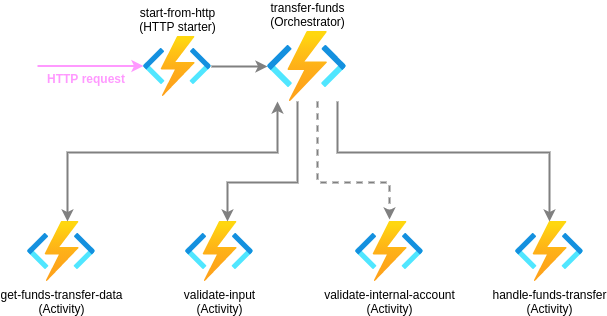

# azure-durablefunctions-python

Companion repository for the **[How to chain Azure Functions and leverage Durable Functions to
reduce the burden when managing long-living serverless workloads](https://medium.com/ci-t/how-to-chain-azure-functions-c11da1048353)**
blog post, addressing technical facets of microservices orchestration under the Microsoft Azure
umbrella with [Azure Functions](https://azure.microsoft.com/en-us/blog/introducing-azure-functions)
and [Durable Functions](https://docs.microsoft.com/en-us/azure/azure-functions/durable/durable-functions-overview?tabs=python).

The blog post brings implementation details that hopefully will help developers thrive when working
with the [Function Chaining](https://docs.microsoft.com/en-us/azure/azure-functions/durable/durable-functions-overview?tabs=python#chaining)
and [Async HTTP APIs](https://docs.microsoft.com/en-us/azure/azure-functions/durable/durable-functions-overview?tabs=python#async-http)
application patterns.

## Sample application

The dummy Funds Transfer App comprises 4 business steps, each of them implemented as an
Azure Function:



Main characteristics:

1. `get-funds-transfer-data` returns a value to the orchestrator;

1. `get-funds-transfer-data`, `validate-input`, and `handle-funds-transfer` are mandatory and must
   run in this order;

1. `validate-internal-account` is optional can execute between `validate-input` and
   `handle-funds-transfer` under certain conditions.

## Quickstart guide

1. Create an Azure Function using the Azure Portal.

1. Clone this repo:

   ```sh
   git clone https://github.com/ricardolsmendes/azure-durablefunctions-python.git
   ```

1. Publish the Azure Function:

   ```sh
   cd azure-durablefunctions-python || exit
   func azure functionapp publish <YOUR-FUNCTION-NAME>
   ```

   _The HTTP URI will be displayed at the end of the publishing logs — replace `{functionName}`
   with `transfer-funds`._

1. Use [Postman](https://www.postman.com) or equivalent tool to make requests and see it in
   action. Please use the below content as a reference request body:

   ```json
   {
     "metadata": {
       "requestId": "6d79dbfb",
       "requestType": "fundsTransfer"
     },
     "data": {
       "sourceAccount": {
         "id": "123456",
         "bankId": "001"
       },
       "targetAccount": {
         "id": "456789",
         "bankId": "002"
       }
     }
   }
   ```

   This will result in successful execution. The validation errors and optional execution path
   can be activated by applying slight changes to it:

   - remove `data`, `data.sourceAccount`, or `data.targerAccount` to see the validation errors;
   - change `data.targetAccount.bankId` to `001` to run `validate-internal-account` in a given
     workflow.

## How to contribute

Please make sure to take a moment and read the [Code of
Conduct](https://github.com/ricardolsmendes/azure-durablefunctions-python/blob/main/.github/CODE_OF_CONDUCT.md).

### Report issues

Please report bugs and suggest features via the [GitHub
Issues](https://github.com/ricardolsmendes/azure-durablefunctions-python/issues).

Before opening an issue, search the tracker for possible duplicates. If you find a duplicate, please
add a comment saying that you encountered the problem as well.

### Contribute code

Please make sure to read the [Contributing
Guide](https://github.com/ricardolsmendes/azure-durablefunctions-python/blob/main/.github/CONTRIBUTING.md)
before making a pull request.
